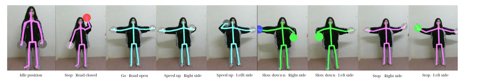

# Spatial-Temporal Dynamics Skeletal Graph-Based Human Action Recognition for Vietnamese Traffic Police Gestures

## 📋 Overview

This repository contains the implementation of a skeletal graph-based human action recognition system specifically designed for recognizing Vietnamese traffic police gestures. The system utilizes spatial-temporal dynamics to analyze skeleton data captured from Microsoft Kinect v2 sensor for accurate gesture classification.

In this research, we proposed the **International School - Traffic Police Action (IS-TPA) dataset**, a novel benchmark specifically designed for Human Action Recognition (HAR) of Vietnamese traffic police gestures during traffic direction scenarios. The IS-TPA dataset addresses the unique challenges of recognizing standardized traffic control gestures, which exhibit distinct spatiotemporal patterns compared to general human actions. Our dataset consists of eight distinct action classes representing fundamental traffic control gestures commonly employed by Vietnamese traffic police officers.

## 🎯 Dataset

### Dataset Information
- **Dataset Name**: IS-TPA (International School - Traffic Police Action)
- **Sensor**: Microsoft Kinect v2
- **Total Classes**: 8 action classes
- **Joints per Skeleton**: 25 joints
- **Frame Rate**: 30 FPS

### IS-TPA Dataset Action Class Descriptions

The dataset comprises 8 distinct traffic police gesture classes representing fundamental traffic control gestures commonly employed by Vietnamese traffic police officers


*Figure 1: IS-TPA Dataset Action Class Descriptions*

### Dataset Structure

```
Dataset/
├── 0/
│   ├── class_0_0000.json
│   ├── class_0_0001.json
│   └── ...
├── 1/
│   ├── class_1_0000.json
│   └── ...
├── 2/
├── 3/
├── 4/
├── 5/
├── 6/
└── 7/
```

## 📄 License

This project is licensed under the MIT License - see the [LICENSE](LICENSE) file for details.

## 📚 Citation

If you use this dataset or code in your research, please cite:

```bibtex
@inproceedings{istpa2025,
  title={IS-TPA: Spatial-Temporal Dynamics Skeletal Graph-Based Human Action Recognition for Vietnamese Traffic Police Gestures},
  author={Quang-Anh N.D., Mai-Hanh Nguyen Thi, Tien Dat Nguyen, Quoc Bao Doan, Ha Phuong Vu, Kieu Oanh Do Thi, Truong Linh Nguyen Thanh, Manh-Hung Ha},
  booktitle = {2nd Asia Meeting on Environment and Electrical Engineering},
  year={2025},
  publisher={IEEE},
}
```
